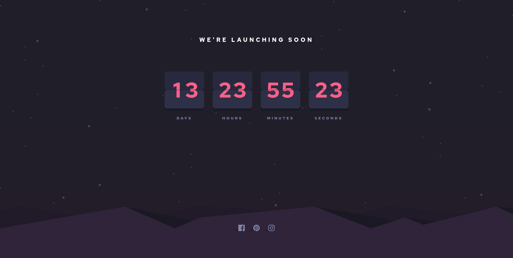

# Frontend Mentor - Launch countdown timer solution

This is a solution to the [Launch countdown timer challenge on Frontend Mentor](https://www.frontendmentor.io/challenges/launch-countdown-timer-N0XkGfyz-). Frontend Mentor challenges help you improve your coding skills by building realistic projects. 

## Table of contents

- [Overview](#overview)
  - [The challenge](#the-challenge)
  - [Screenshot](#screenshot)
  - [Links](#links)
- [My process](#my-process)
  - [Built with](#built-with)
  - [What I learned](#what-i-learned)
  - [Continued development](#continued-development)
- [Author](#author)

**Note: Delete this note and update the table of contents based on what sections you keep.**

## Overview

### The challenge

Users should be able to:

- See hover states for all interactive elements on the page
- See a live countdown timer that ticks down every second (start the count at 14 days)
- **Bonus**: When a number changes, make the card flip from the middle

### Screenshot



### Links

- Solution URL: [Add solution URL here](https://github.com/curviture/countdown)
- Live Site URL: [Add live site URL here](https://curviture.github.io/countdown/)

## My process

### Built with

- CSS custom properties
- Flexbox
- Vanilla JS
- Animations partially created/controlled with Web Animations API


### What I learned

I learned using Web Animations API to create animations of flipping cards.

```js
          let a = this.box.querySelector('.field__tile__current .tile__up').animate(slideDown, timingDown);
          a.addEventListener('finish', this.changeNext_1.bind(this))
          a.commitStyles('transform: rotateX(-90deg)');
```

### Continued development

Adding audio for this click. Ticking sound probably sounds like a good idea.

**Note: Delete this note and the content within this section and replace with your own plans for continued development.**

## Author

- Frontend Mentor - [@curviture](https://www.frontendmentor.io/profile/curviture)
